# Wallace_Sklansky
4x4 Wallace tree multiplier using Sklansky
## Table of Contents

- [Introduction](https://github.com/Sairamakula1999/Wallace_Sklansky/blob/main/README.md#introduction)
- [Circuit Design](https://github.com/Sairamakula1999/Wallace_Sklansky/blob/main/README.md#Circuit-Design)
- [Circuit Implementation](https://github.com/Sairamakula1999/Wallace_Sklansky/blob/main/README.md#Circuit-Implementation)
- [Simulation Results](https://github.com/Sairamakula1999/Wallace_Sklansky/blob/main/README.md#simulation-results)
- [Conclusion](https://github.com/Sairamakula1999/Wallace_Sklansky/blob/main/README.md#conclusion)
- [Author](https://github.com/Sairamakula1999/Wallace_Sklansky/blob/main/README.md#author) 
- [Acknowledgements](https://github.com/Sairamakula1999/Wallace_Sklansky/blob/main/README.md#acknowledgements)
- [References](https://github.com/Sairamakula1999/Wallace_Sklansky/blob/main/README.md#references)

## Introduction
In high performance processing units & computing systems, multiplication of two binary numbers is primitive and most frequently used arithmetic operation. Wallace tree multiplier is area efficient & high speed multiplier. This paper, we are also using Sklansky parallel prefix adder to speed up the circuit. The design has been created on Synopsis [Custom Compiler](https://www.synopsys.com/implementation-and-signoff/custom-design-platform/custom-compiler.html) software and simulated using [PrimeWave](https://www.synopsys.com/implementation-and-signoff/ams-simulation/primewave.html) environment. 

Fig 1. conventional wallace multplier

## Circuit Design
In this instead of approaching a circuit in a conventional  manner, every alternate stages are inverted to remove extraneous inverters which saves area by a lot and use of sklansky increases performance of circuit by a lot. So, in this we have tried to get best of both worlds like min area by decreasing no. transistors and less propagation delay by wallace with sklansky parallel prefix adder.

Partial products are generated using nand gates which decreased no.of transistors required by a lot. Using conventional and gate we may require 6(transistors for a single and gate) x 16(partial products)= 96 transistors. but in our approach we may require 16(partial products) x  nand(4 transistors) + inverter(2 transistors) x 5(inverted since they are used for not the first stage after partial products but for a second stage. So, one has to make them inverted again to maintain polarity) = 74 transistors. So nearly 22 transistors save in this stage only.

Fig 2. partial products

Ripple sum and carry adder is used as it also inverts the Sum and carry each stage. If inverted inputs are given to this adder we get correct sum and carry and vice-versa.
Total 5x full adder(24 transistors)= 120 transistors.

Fig 3. full adder

for half carry adder xor and nand gates in odd stage, xor and nor in even stage. since in both carry is taken from nand/ nor i.e. 2 transistors are saved per each carry. 3 x half adder(xor(12 transistors) + carry(4 transistors for nand/ nor))= 48 transistors.

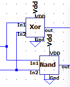
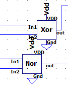

Fig 4. half adder

Instead of using ripple carry adder Sklansky adder is used to reduce propagation delay and  and improve speed of circuit at the final stage and based on even or odd stage, grey and black cell used may be varied to remove extraneous inverters but if even-even or odd-odd stage connection requires inverters to be added in between them to maintain the polarity and maintain functioning. Since, pg generated in even stage xor and nor are used. if it is generated in odd stage xor and nand can be used. Total transistors for pg generation  4 x pg generation(p(12 transistors for xor) + g(4 transistors for nand/ nor))= 64 transistors. 1 x black cell(10 transistors) + 3 x grey cell(6 transistors) + 2x inverters(2 transistors) + 3 x xor gates(12 transistors)= 68 transistors. Total transistor in this sklansky stage= 64+68= 132 transistors.

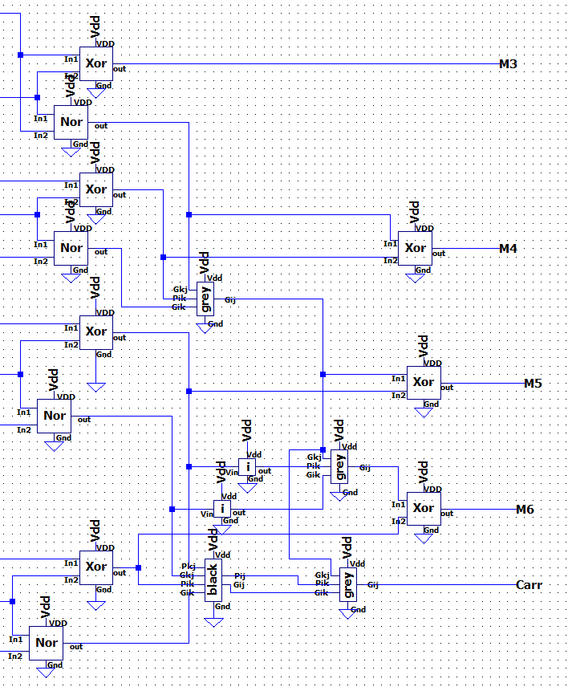

Fig 5. sklanasky adder

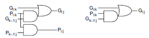

Fig 6. black and grey cell

## Circuit Implementation

inv implementation

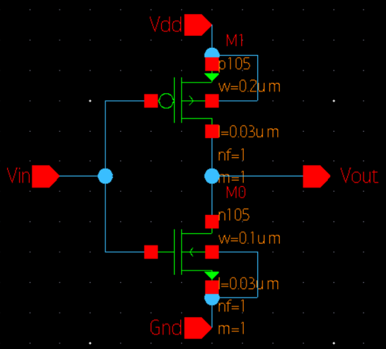

Fig 7. inverter

nand implementation

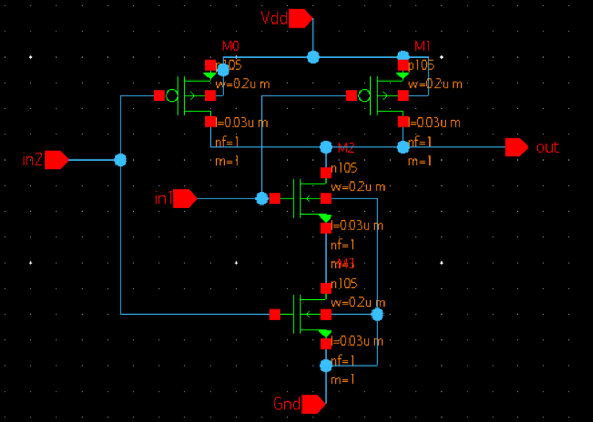

Fig 8. nand

nor implementation

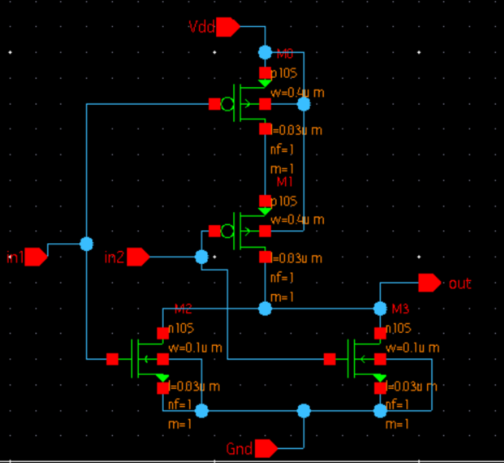

Fig 9. nor

xor implementation

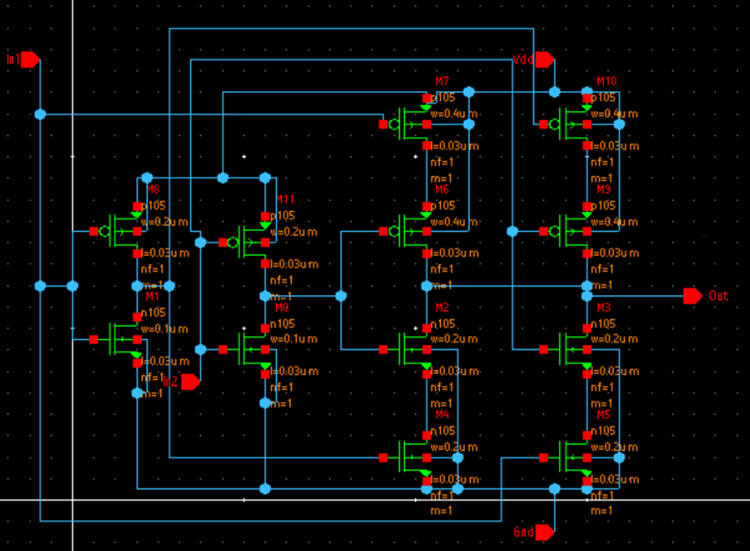

Fig 10. xor

sum implementation

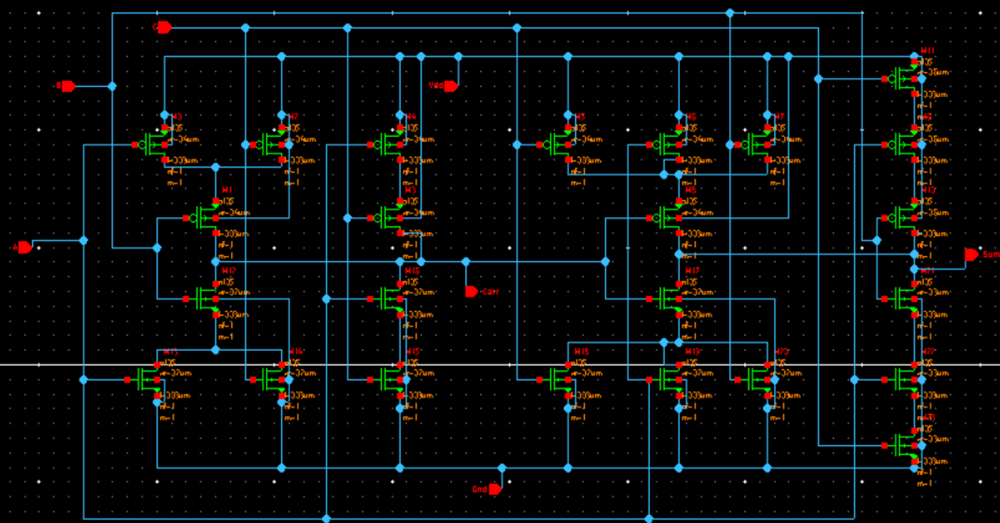

Fig 11. sum

grey cell implementation

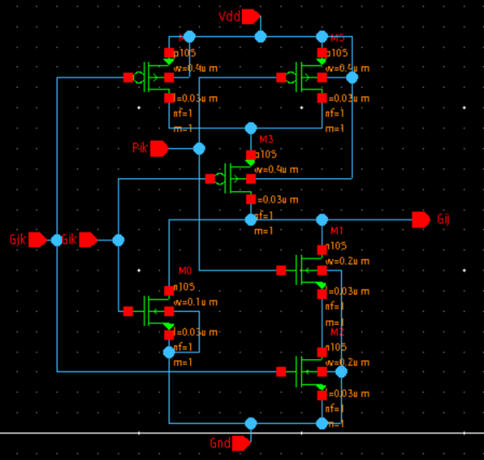
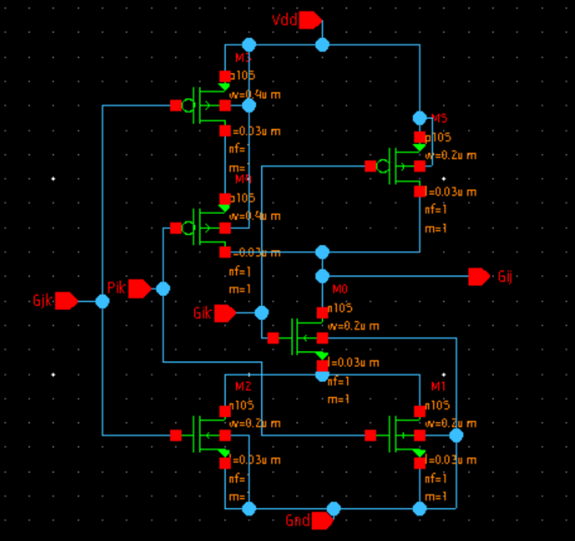

Fig 12. grey cells for even and odd stages

black cell implementation
Since only one stage in black. So, it is created for only even stage.

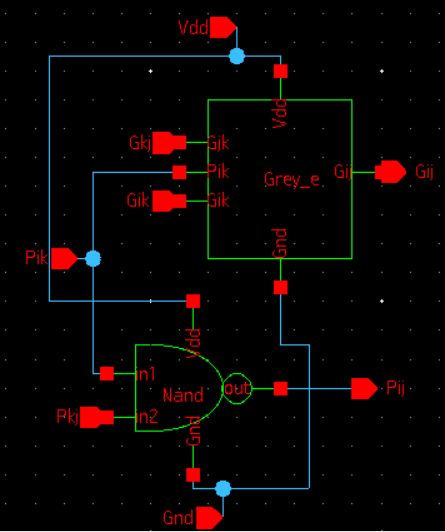

Fig 13. black

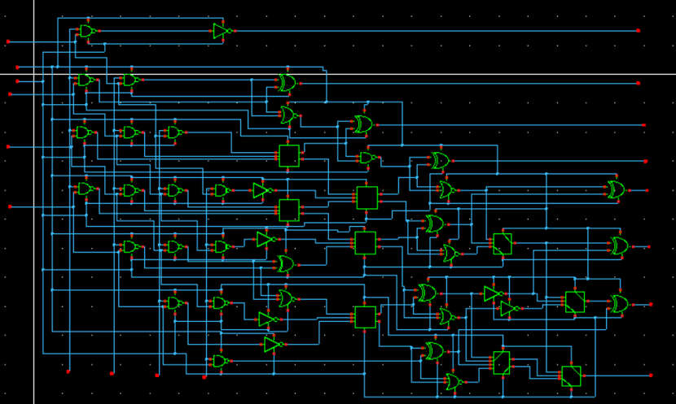

Fig 14. Designed 4x4 wallace sklansky tree multiplier.

## Simulation results

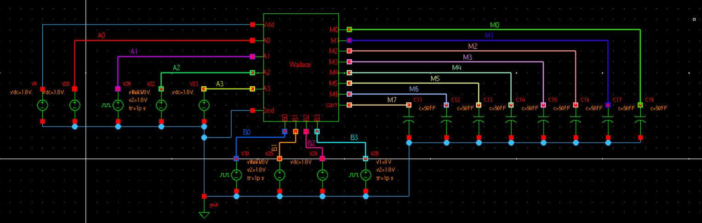

Fig 15. ckt used for simulation

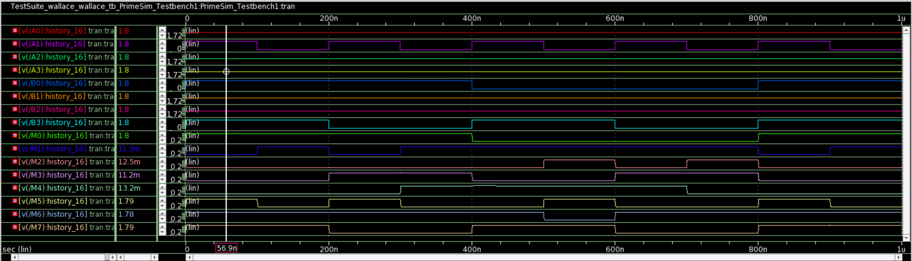

Fig 16. Simulation results

As one can observe for inputs all one(i.e 1.8v) which gives A=15 & B=15, we gout output (1000111)= 1+32+64+128=225(15x15). So, our results are evaluated one can check similarly with other inputs in simulation and intially all inputs are one unless they are changed. So, one may observe output accordingly. 

## More changes to be done till March 1st So please wait till then to evaluate
