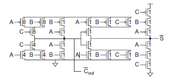

# Wallace_Sklansky
4x4 Wallace tree multiplier using Sklansky
## Table of Contents

- [Introduction](https://github.com/Sairamakula1999/Wallace_Sklansky/edit/main/README.md#introduction)

- [Circuit Design](https://github.com/Sairamakula1999/Wallace_Sklansky/edit/main/README.md#circuit-design)
- [Simulation Results](https://github.com/Sairamakula1999/Wallace_Sklansky/edit/main/README.md#simulation-results)
- [Performance Comparison](https://github.com/Sairamakula1999/Wallace_Sklansky/edit/main/README.md#performance-comparison)
- [Conclusion](https://github.com/Sairamakula1999/Wallace_Sklansky/edit/main/README.md#conclusion)
- [Author](https://github.com/Sairamakula1999/Wallace_Sklansky/edit/main/README.md#author) 
- [Acknowledgements](https://github.com/Sairamakula1999/Wallace_Sklansky/edit/main/README.md#acknowledgements)
- [References](https://github.com/Sairamakula1999/Wallace_Sklansky/edit/main/README.md#references)

## Introduction
In high performance processing units & computing systems, multiplication of two binary numbers is primitive and most frequently used arithmetic operation. Wallace tree multiplier is area efficient & high speed multiplier. This paper, we are also using Sklansky parallel prefix adder to speed up the circuit. The design has been created on Synopsis [Custom Compiler](https://www.synopsys.com/implementation-and-signoff/custom-design-platform/custom-compiler.html) software and simulated using [PrimeWave](https://www.synopsys.com/implementation-and-signoff/ams-simulation/primewave.html) environment. 

Fig 1. conventional wallace multplier

## circuit-design
In this instead of approaching a circuit in a conventional  manner, every alternate stages are inverted to remove extraneous inverters which saves area by a lot and use of sklansky increases performance of circuit by a lot. So, in this we have tried to get best of both worlds like min area by decreasing no. transistors and less propagation delay by wallace with sklansky parallel prefix adder.

Partial products are generated using nand gates which decreased no.of transistors required by a lot. Using conventional and gate we may require 6(transistors for a single and gate) x 16(partial products)= 96 g. but in our approach we may require 4(transistors for a single nand gate) x 16(partial products) + 2(transistors for an inverter) x 5( inverted since they are used for not the first stage after partial products but for a second stage. So, one has to make them inverted again to get required output) = 74 gates  

Fig 2. partial products

Ripple sum and carry adder is used as it also inverts the Sum and carry each stage. If inverted inputs are given to this adder we get correct sum and carry and vice-versa.

Fig 2. full adder

