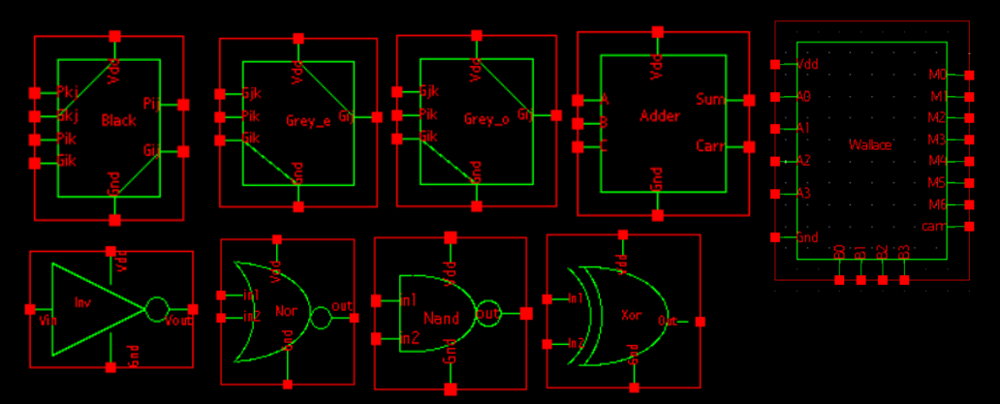
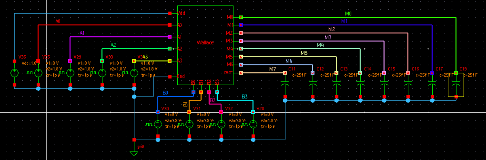
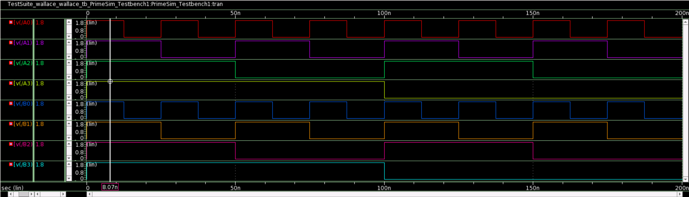
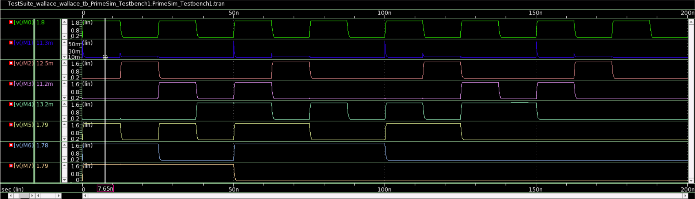

# Wallace_Sklansky
4x4 Wallace tree multiplier using Sklansky
## Table of Contents

- [Introduction](https://github.com/Sairamakula1999/Wallace_Sklansky/blob/main/README.md#introduction)
- [Circuit Design](https://github.com/Sairamakula1999/Wallace_Sklansky/blob/main/README.md#Circuit-Design)
- [Circuit Implementation](https://github.com/Sairamakula1999/Wallace_Sklansky/blob/main/README.md#Circuit-Implementation-using-synopsys-28nm-technological-node)
- [Simulation Results](https://github.com/Sairamakula1999/Wallace_Sklansky/blob/main/README.md#simulation-results)
- [Conclusion](https://github.com/Sairamakula1999/Wallace_Sklansky/blob/main/README.md#conclusion)
- [Author](https://github.com/Sairamakula1999/Wallace_Sklansky/blob/main/README.md#author) 
- [Acknowledgements](https://github.com/Sairamakula1999/Wallace_Sklansky/blob/main/README.md#acknowledgements)
- [References](https://github.com/Sairamakula1999/Wallace_Sklansky/blob/main/README.md#references)

## Introduction
In high performance processing units & computing systems, multiplication of two binary numbers is primitive and most frequently used arithmetic operation. Wallace tree multiplier is area efficient & high speed multiplier. Here Sklansky parallel prefix adder is also being used to speed up addition at final stage of the circuit. The design has been created on Synopsis [Custom Compiler](https://www.synopsys.com/implementation-and-signoff/custom-design-platform/custom-compiler.html) software and simulated using [PrimeWave](https://www.synopsys.com/implementation-and-signoff/ams-simulation/primewave.html) environment. 

Fig 1. conventional wallace multplier

## Circuit Design
In this instead of approaching a circuit in a conventional  manner, every alternate stages are inverted to remove extraneous inverters which saves area by a lot and use of sklansky increases performance of circuit by a lot. So, in this we have tried to get best of both worlds like min area by decreasing no. transistors and less propagation delay by wallace with sklansky parallel prefix adder. Here we have only used cmos based approach, if transmission gate or pass transistor logic are also considered then the transistors can be further reduced.

Partial products are generated using nand gates which decreased no.of transistors required by a lot. Using conventional and gate we may require 6(transistors for a single and gate) x 16(partial products)= 96 transistors. but in our approach we may require 16(partial products) x  nand(4 transistors) + inverter(2 transistors) x 5(inverted since they are used for not the first stage after partial products but for a second stage. So, one has to make them inverted again to maintain polarity) = 74 transistors. So nearly 22 transistors save in this stage only.

Fig 2. partial products

Ripple sum and carry adder is used as it also inverts the Sum and carry each stage. If inverted inputs are given to this adder we get correct sum and carry and vice-versa.
Total 5x full adder(24 transistors)= 120 transistors.

Fig 3. full adder

for half carry adder xor and nand gates in odd stage, xor and nor in even stage. since in both carry is taken from nand/ nor i.e. 2 transistors are saved per each carry. 2 x half adder(xor(12 transistors) + carry(4 transistors for nand/ nor))= 32 transistors. So, first stage + second stage=152 transistors.

Fig 4. half adder

Instead of using ripple carry adder Sklansky adder is used to reduce propagation delay and  and improve speed of circuit at the final stage and based on even or odd stage, grey and black cell used may be varied to remove extraneous inverters but if even-even or odd-odd stage connection requires inverters to be added in between them to maintain the polarity and maintain functioning. Since, pg generated in even stage xor and nor are used. if it is generated in odd stage xor and nand can be used. Total transistors for pg generation  4 x pg generation(p(12 transistors for xor) + g(4 transistors for nand/ nor))= 64 transistors. 1 x black cell(10 transistors) + 3 x grey cell(6 transistors) + 2x inverters(2 transistors) + 3 x xor gates(12 transistors)= 68 transistors. Total transistor in this sklansky stage= 64+68= 132 transistors. if we have used ripple adder here instead of sklansky=98 transistors(1 x halfadder(16 transistors) + 3 x fulladder(24 transistors) + 5 x inverter(since inputs or sum has to be inverted after eachh stage) ) will be sufficient. But to speed up the multiplication we have used sklansky adder.

Fig 5. sklanasky adder

Fig 6. black and grey cell

## Circuit Implementation using synopsys 28nm technological node

<b>Inverter implementation</b>

Fig 7. inverter

<b>Nand implementation</b>

Fig 8. nand

<b>Nor implementation</b>

Fig 9. nor

<b>Xor implementation</b>

Fig 10. xor

<b>Sum implementation</b>

Fig 11. sum

<b>Grey cell implementation</b>

Fig 12. grey cells for even and odd stages

<b>Black cell implementation</b>
Since only one stage in black. So, it is created for only even stage.

Fig 13. black

<b>Symbols</b> of every cell generated are given below:

Fig 14. Symbols

Fig 15. Designed 4x4 wallace sklansky tree multiplier.

## Simulation results

Fig 16. ckt used for simulation

for input variations

Fig 17. input Simulation 

Corresponding output simulations are:

Fig 18. output Simulation 

As one can observe for inputs all one(i.e 1.8v) which gives A=15(1111) & B=15(1111), for that corresponding output observed=(1000111)= (1+32+64+128)=225(15x15). So, results are evaluated one can check similarly with other inputs in simulation and may observe output accordingly. 

## Conclusion
Total transistor count for wallace tree multiplier using sklansky= 74(partial products) + 152(for first and second stage) + 132(3rd stage)= 358 transistors.
if implemented using riiple carry adder as last stage then total transistor count for wallace tree multiplier= 74(partial products) + 152(for first and second stage) + 98(3rd stage)= 324 transistors.
By decreasing output load attached and adjusting gate sizing accordingly one can speedup the transistor as they require.
## Author 
Akula Sairam, Mtech Microelectronics at Indian Institute of information Technology Allahabad, Prayagraj, Uttar Pradesh 211015.

## Acknowledgements
•	[Kunal Ghosh, Co-founder, VSD Corp. Pvt. Ltd.](https://www.linkedin.com/in/kunal-ghosh-vlsisystemdesign-com-28084836/) 
•	[Cloud Based Analog IC Design Hackathon](https://www.iith.ac.in/events/2022/02/15/Cloud-Based-Analog-IC-Design-Hackathon/) 
•	[Synopsys India](https://www.synopsys.com/) 

## References
•	https://www.ijert.org/research/simulation-model-of-wallace-tree-multiplier-using-verilog-IJERTV2IS101107.pdf 
•	http://www.ijaema.com/gallery/72-october-2591.pdf 
•	CMOS VLSI Design A Circuits by Neil H. E. Weste, David Money Harris 

## More changes to be done till March 1st So please wait till then to evaluate
